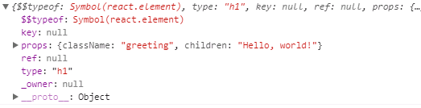

* content
{:toc}

React 好像已经火了很久很久，以致于我们对于 Virtual DOM 这个词都已经很熟悉了，网上也有非常多的介绍 React、Virtual DOM 的文章。但是直到前不久我专门花时间去学习 Virtual DOM，才让我对 Virtual DOM 有了一定的理解。在此分享下。

### 1. Virtual DOM

Virtual DOM 概况来讲，实际上实在游览器端用 JavaScript 实现了一套 DOM Api，就是在数据和真实 DOM 之间建立了一层缓冲。对于开发者而言，数据变化了就调用 React 的渲染方法，而 React 并不是直接得到新的 DOM 进行替换，而是先生成 Virtual DOM，与上一次渲染得到的 Virtual DOM 进行比对，在渲染得到的 Virtual DOM 上发现变化，然后将变化的地方更新到真实 DOM 上。

[virtual-dom](https://github.com/Matt-Esch/virtual-dom)

构建一个简易的 Virtual DOM 模型并不复杂，只要使它具备真实 DOM 标签所具有的基本属性就行，包括：

- tagName(标签名)
- properties(节点属性，包含样式、属性、事件等)
- children(子节点)
- key(标识id)

```js
{
    tagName: 'div',
    properties: {
        style: {}
    },
    children: [],
    key: 1
}
```

Virtual DOM 模型当然更加复杂，不止这些属性。

### 2. 创建 Virtual DOM

Virtual DOM 中的节点称为 ReactNode，它分为 3 种类型 ReactElement、ReactFragment、ReactText，其中 ReactElement 又分为 ReactCompomentElement 和 ReactDOMElement。

React 通过 [createElement](https://github.com/facebook/react/blob/master/packages/react/src/ReactElement.js#L171) 方法创建虚拟元素：

Babel 将 JSX 编译成 `React.createElement()` 调用。下面的两个例子是是完全相同的：

```js
const element = (
    <h1 className="greeting">
        Hello, world!
    </h1>
);

const element = React.createElement(
    'h1',
    {className: 'greeting'},
    'Hello, world!'
);
```

`createElement` 会返回一个 `ReactElement` 实例对象

```js
export function createElement(type, config, children) {
    let propName;

    // Reserved names are extracted
    const props = {};

    let key = null;
    let ref = null;
    let self = null;
    let source = null;

    // 如果 config 存在，则提取里面的内容
    if (config != null) {
        if (hasValidRef(config)) {
            ref = config.ref;
        }
        if (hasValidKey(config)) {
            key = '' + config.key;
        }

        self = config.__self === undefined ? null : config.__self;
        source = config.__source === undefined ? null : config.__source;
        // 复制 config 中的内容到 props
        for (propName in config) {
            if (
                hasOwnProperty.call(config, propName) &&
                !RESERVED_PROPS.hasOwnProperty(propName)
            ) {
                props[propName] = config[propName];
            }
        }
    }

    // 处理 children，挂到 props.children 属性上
    // 如果只有一个，则直接赋值；若有多个，则合并为 childArray 再赋值
    const childrenLength = arguments.length - 2;
    if (childrenLength === 1) {
        props.children = children;
    } else if (childrenLength > 1) {
        const childArray = Array(childrenLength);
        for (let i = 0; i < childrenLength; i++) {
            childArray[i] = arguments[i + 2];
        }
        if (__DEV__) {
            if (Object.freeze) {
                Object.freeze(childArray);
            }
        }
        props.children = childArray;
    }

    // 若某个 prop 为空但存在默认的 defaultProp，则将默认值赋值给当前的 prop
    if (type && type.defaultProps) {
        const defaultProps = type.defaultProps;
        for (propName in defaultProps) {
            if (props[propName] === undefined) {
                props[propName] = defaultProps[propName];
            }
        }
    }
    if (__DEV__) {
        if (key || ref) {
            if (
                typeof props.$$typeof === 'undefined' ||
                props.$$typeof !== REACT_ELEMENT_TYPE
            ) {
                const displayName =
                    typeof type === 'function' ?
                    type.displayName || type.name || 'Unknown' :
                    type;
                if (key) {
                    defineKeyPropWarningGetter(props, displayName);
                }
                if (ref) {
                    defineRefPropWarningGetter(props, displayName);
                }
            }
        }
    }
    // 返回一个 ReactElement 对象
    return ReactElement(
        type,
        key,
        ref,
        self,
        source,
        ReactCurrentOwner.current,
        props,
    );
}
```

看了下源码，再打印下 element 看下返回的 ReactElement 实例对象具体是什么：



接下来看下 [React.Component](https://github.com/facebook/react/blob/master/packages/react/src/ReactBaseClasses.js#L17)

```js
function Component(props, context, updater) {
    this.props = props;
    this.context = context;
    this.refs = emptyObject;

    this.updater = updater || ReactNoopUpdateQueue;
}

Component.prototype.isReactComponent = {};

Component.prototype.setState = function (partialState, callback) {
    invariant(
        typeof partialState === "object" ||
        typeof partialState === "function" ||
        partialState == null,
        "setState(...): takes an object of state variables to update or a " +
        "function which returns an object of state variables."
    );
    this.updater.enqueueSetState(this, partialState, callback, "setState");
};

Component.prototype.forceUpdate = function(callback) {
    this.updater.enqueueForceUpdate(this, callback, 'forceUpdate');
};
```

### 3. 初始化组件

我们用 babel 转换一下代码：

```js
class A extends React.Component {
    constructor(props) {
        super(props)
    }

    render() {
        <div>
            <p>A</p>
        </div>
    }
}

<!-- 转化为 -->
var A = _wrapComponent("A")(
    (function (_React$Component) {
        _inherits(A, _React$Component);

        function A(props) {
            _classCallCheck(this, A);

            return _possibleConstructorReturn(
                this,
                (A.__proto__ || Object.getPrototypeOf(A)).call(this, props)
            );
        }

        _createClass(A, [{
            key: "render",
            value: function render() {
                _react3.default.createElement(
                    "div",
                    null,
                    _react3.default.createElement("p", null, "A")
                );
            }
        }]);

        return A;
    })(_react3.default.Component)
);
```

我们发现 render 方法实际上是调用了 `React.createElement` 方法。这前面已经介绍过了。